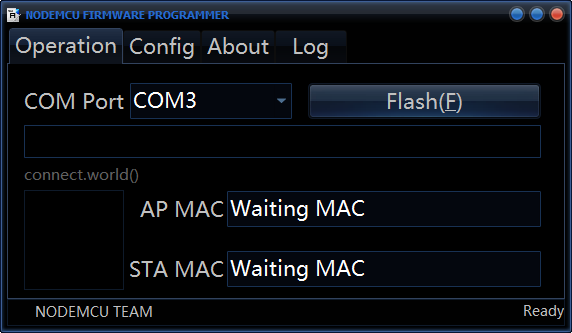
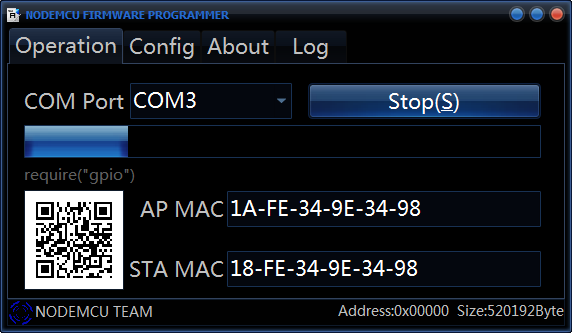
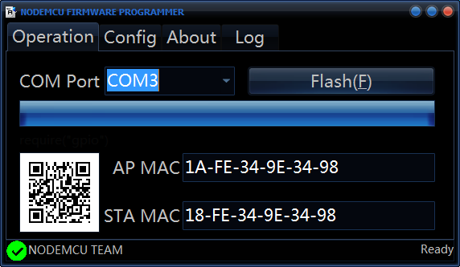
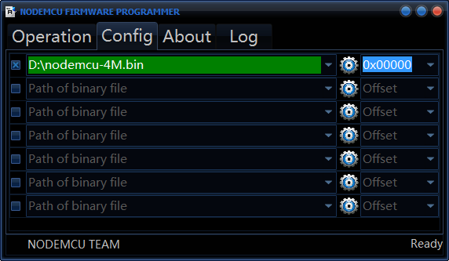

NodeMCU Flasher
===============

NodeMCU flasher is a firmware programmer for NodeMCU DEVKIT V0.9.

You can use it to program NodeMCU DEVKIT or your own ESP8266 board.

You MUST set GPIO0 to LOW before programming, and NodeMCU DEVKIT V0.9 will do it automatically.

This is demo version.

We are working on next version and will use QT framework. 

It will be cross platform and open source.

Usage
---------------
Just click flash and you can burn firmware to ESP8266. Before you doing it, GPIO0 MUST LOW.

And wait a moment.

Program success.

Setting your own firmware.

When the path have some error(e.g. file not exist), the line will become red.

Tips: You could use some special path to do something interesting.

The blank.bin file:

INTERNAL://BLANK

The esp_init_data_default.bin file(for 26MHz crystal):

INTERNAL://DEFAULT
